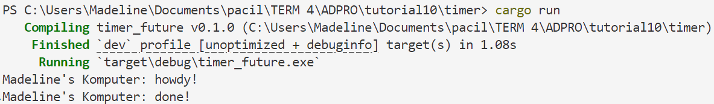
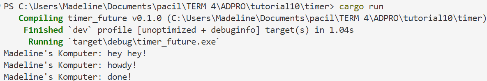
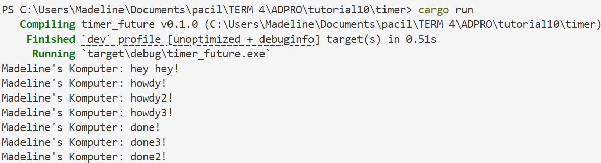
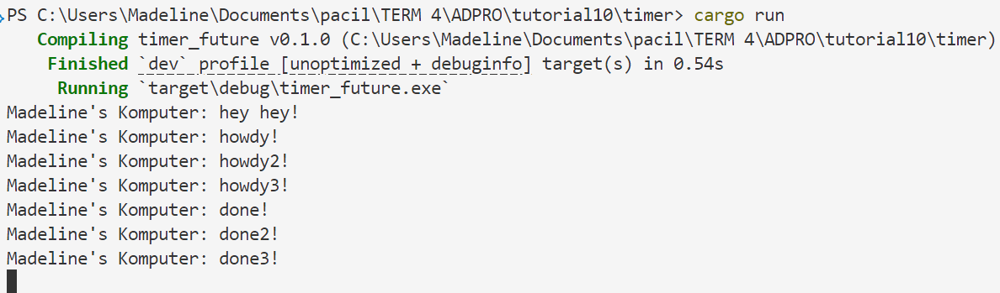

# Tutorial 10 Pemrograman Lanjut: Timer
### Madeline Clairine Gultom - 2306207846 - ADPRO A

## Understanding How It Works

Pada gambar di atas, kita dapat melihat bahwa output yang dihasilkan adalah "howdy!" dan "done!" karena program sedang menjalani fungsi `async` yang akan dijalankan setelah pemanggilan `executor.run()`. 

Sedangkan pada ketika terdapat penambahan kode `println!("Madeline's Komputer: hey hey!");` setelah bagian `spawner.spawn(async {`, maka perintah print "hey hey!" tersebut akan dieksekusi terlebih dahulu karena potongan kode tersebut berada pada program utama di mana tidak perlu menunggu executor dijalankan terlebih dahulu. Setelah itu, barulah disusul dengan pemanggilan `executor.run()` dan menjalani perintah yang terdapat dalam fungsi `async` seperti pada gambar berikut.

## Multiple Spawn and Removing Drop 
Saya mencoba untuk mereplikasi fungsi `async` menjadi bertotalan tiga fungsi. Jika kita lihat pada gambar di bawah, output "done", "done2", dan "done3" muncul dengan tidak berurutan. Hal ini terjadi karena eksekusi ketiga task `async` tersebut berjalan secara concurrent. Ketiga fungsi ini ditangani oleh `executor` secara independen satu sama lain, dan masing-masing menunggu selama 2 detik menggunakan `TimerFuture`.

Selanjutnya, ketika saya menghapus atau komen bagian potongan kode `drop(spawner);`, maka ketika program dijalankan, program akan berjalan terus tanpa henti karena `executor` tidak tahu bahwa tidak akan ada lagi task baru yang akan dikirim. Oleh karena itu, penting untuk mendeklarasikan `drop(spawner);` agar `executor` tahu kapan harus selesai mengeksekusi suatu program. 
